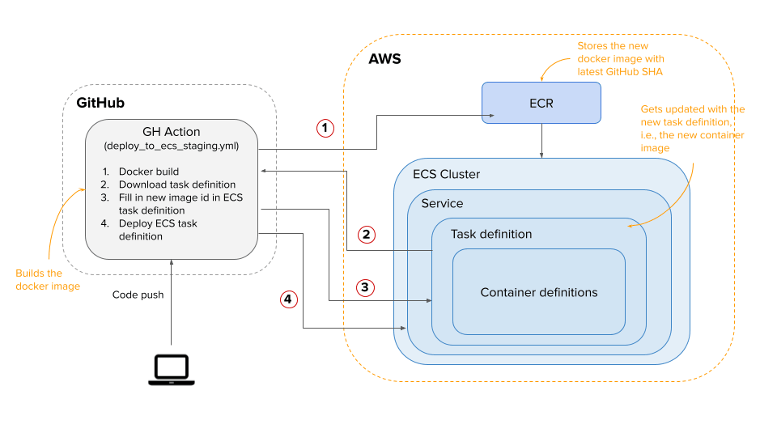

## Deployment
This document covers steps on setting up this repository on various cloud hosting providers.

  - [AWS](#aws)

### AWS

#### Pre-requisites
Deploying on AWS requires a basic understanding of the following tools and services:
1. Docker
2. GitHub actions & workflows
3. GitHub environments and secrets
4. AWS Elastic Container Registry (ECR)
5. AWS Elastic Container Service (ECS)
6. AWS Virtual Private Cloud (VPC)
7. AWS Fargate
8. AWS Elastic Load Balancer (ELB)
9. AWS Elastic IPs
10. AWS Identity and Access Management (IAM)
11. AWS Relational Database Service (RDS)

#### Staging
Setting up staging environment on AWS is pretty straightforward.
1. Login to your AWS console.
2. Go to VPC. (skip this step if you've already created a VPC when setting up backend repository)
   1. Create a new VPC.
   2. Name it `plio-staging-vpc`.
   3. In IPv4 CIDR block, enter `10.0.0.0/28`.
   4. Click on create button. You will see the new VPC under the list of VPCs.
   5. Check out this [AWS guide for more details on VPC](https://docs.aws.amazon.com/vpc/latest/userguide/working-with-vpcs.html).
3. Create a new Elastic IP by going to EC2 dashboard and navigating to Elastic IP section.
   1. Click on Allocate Elastic IP address and click on Allocate button.
   2. You will see a new IP address in the IPs list. Name it `plio-frontend-staging`.
   3. This will be used in later steps to give the load balancer a permanent IP address.
4. Go to Target groups.
   1. Create a new target group.
   2. Choose target type to be `IP addresses`.
   3. Name the target group as `plio-frontend-staging`.
   4. Select the `plio-staging-vpc` for the target group VPC.
   5. Proceed to create target group. You will see target group in the list.
5. Go to Load Balancers.
   1. Create a new load balancer.
   2. Select Network Load Balancer option. We use NLB for easy support of web socket connections.
   3. Name the LB as `plio-frontend-staging`.
   4. Select the `plio-staging-vpc` for the load balancer.
   5. In the subnet mappings, check the first desired zone and use Elastic IP under IPv4 settings for that subnet.
   6. Under listeners and routing, select the target group `plio-frontend-staging` for TCP port 80.
   7. Proceed to create load balancer. You will see load balancer in the list.
6. Go to ECR and create a new repository named `plio-frontend-staging`.
7. Now go to ECS and create a new task definition with name `plio-frontend-staging`.
   1. Set the task role as `ecsTaskExecutionRole`.
   2. Set the task memory and task CPU based on your needs.
   3. Create a new container with name `plio-frontend-staging`.
   4. Enter port `80` in the port mapping field.
   5. Save the container definition and the task definition.
   6. You will see the new task definition within the list.
8. Under ECS, go to clusters and create a new cluster with name `plio-staging-cluster`. (skip this step if you've already created a VPC when setting up backend repository)
   1. Use `Networking only` option. We will go with serverless deployment so that we don't worry about managing our own server instances.
   2. Don't create a new VPC for your cluster. We'll use the VPC created in previous step in the next step of creating a service.
   3. Click on create button.
   4. You will see the new cluster within the list of clusters.
9.  Get into `plio-staging-cluster` and create a new service.
   1. Set launch type to Fargate. We'll use serverless deployments for Plio.
   2. Name the service as `plio-staging-frontend`.
   3. Under task definition, select `plio-frontend-staging` and use latest revision.
   4. Set the number of tasks to be one.
   5. Service type to be `REPLICA`.
   6. Minimum healthy percentage should be 100 and maximum percent to be 200. Minimum healthy percentage defines the percentage of tasks that should be running at all times. Maximum percent defines how many additional tasks the service can create in parallel to running tasks, before killing the running tasks.
   7.  Deployment type to be `rolling update`.
   8.  Keep other values as default.
   9.  Use the Cluster VPC and the subnet that you configured with Elastic IP.
   10. Auto-assign public IP to have `ENABLED`. Otherwise, it makes the task accessible only through VPC and not public.
   11. Under load balancing, select the Network Load Balancing option and select the `plio-frontend-staging` load balancer.
   12. Inside "Container to Load Balancer", click on Add to load balancer option and select `plio-frontend-staging` in the target group.
   13. For auto-scaling, go with "Do not adjust the service's desired count" for staging.
   14. Review and create service.
10. Next, go to your GitHub repository and create a new environment from settings tab.
    1. Name the environment as `Staging`.
    2. Make sure you have added the following GitHub secrets on repository level. If not, add these as your environment secrets.
       - AWS_ACCESS_KEY_ID
       - AWS_SECRET_ACCESS_KEY
       - AWS_REGION
    3. Additionally, refer to `.env.example` file to set all the other required environment variables for your project.
11. Once done, make some changes to the code so that the GitHub workflow `deploy_to_ecs_staging.yml` gets triggered.

#### Production
Setting up a production environment on AWS is same as staging. Take care of the following things:
1. Rename all services to have `plio-frontend-production` or similar naming convention.
2. Go with auto-scaling option when creating a new service from ECS.

#### Continuous Delivery process

An overview of how continuous delivery cycle works in Plio with GitHub action and Amazon ECR & ECS.
